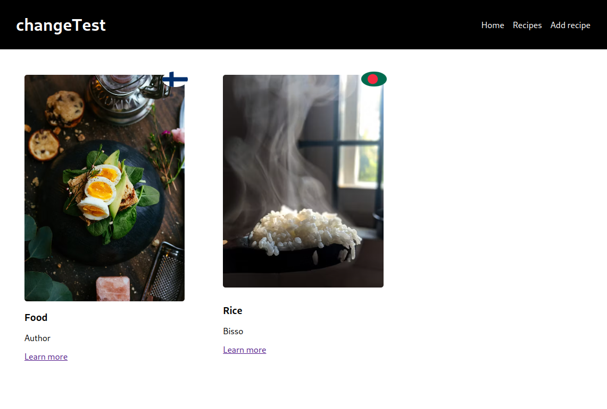

# Recipe App

## Description

This project is part of my React basic course in Helsinki Business college. It's a CRUD app for recipes. Users can view all the prvious reccipe, create new recipe, update existing recipe and delete recipes. I have used Json Server for backend and React and Axios in fontend.



## Installetion

```
git clone https://github.com/Bishwajitkuat/recipe_app_react.git
cd to recipe_app_react
npm install
npm run server
npm start
```

## Technology Used

- React
- Json Server
- Axios
- HTML
- CSS

## Author

Bishwajit Das
